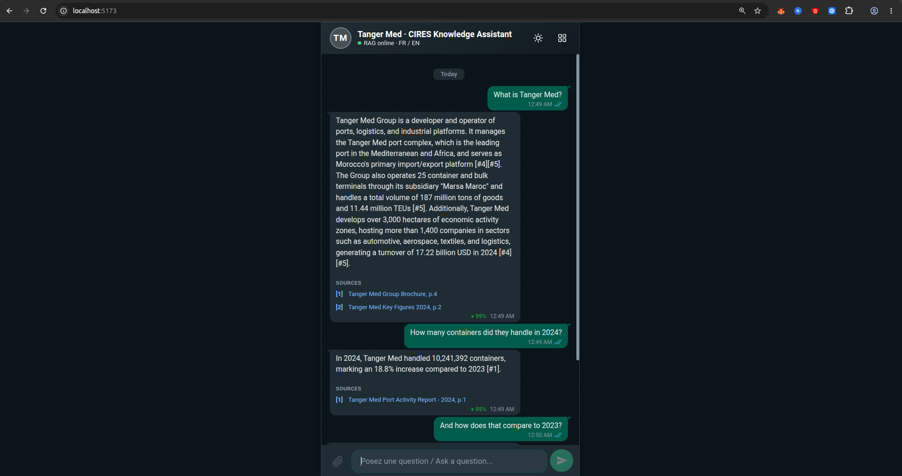
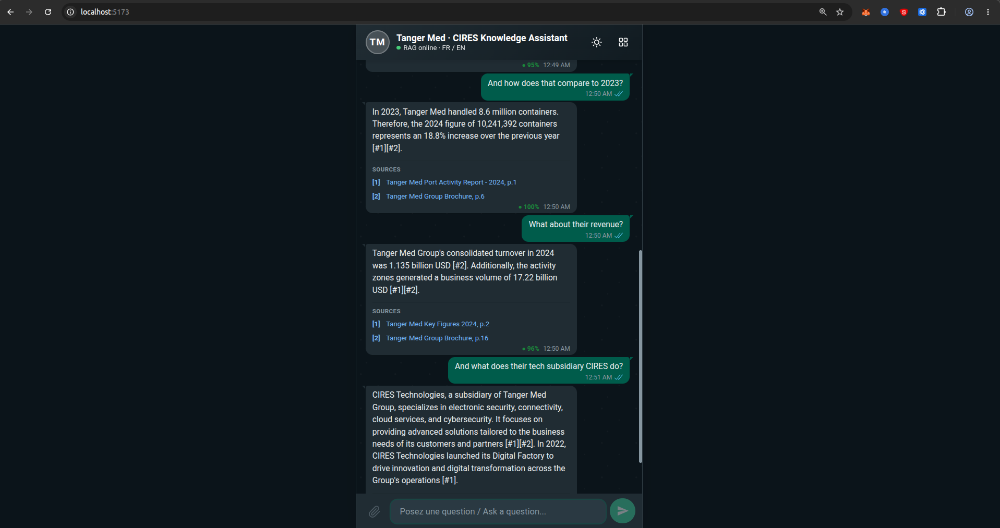
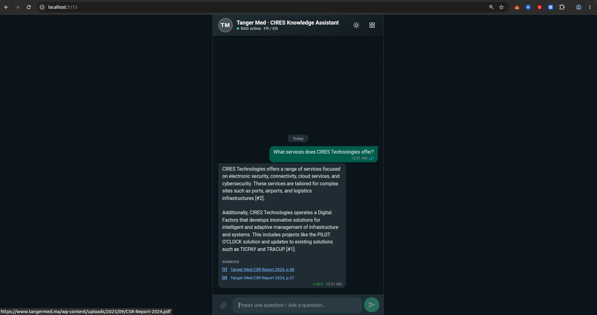
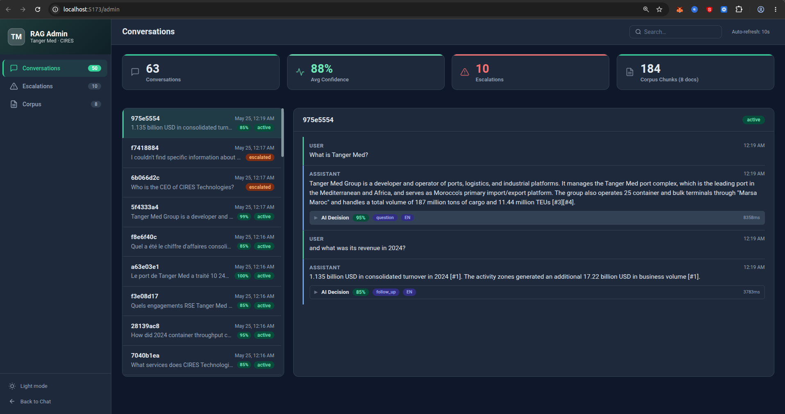
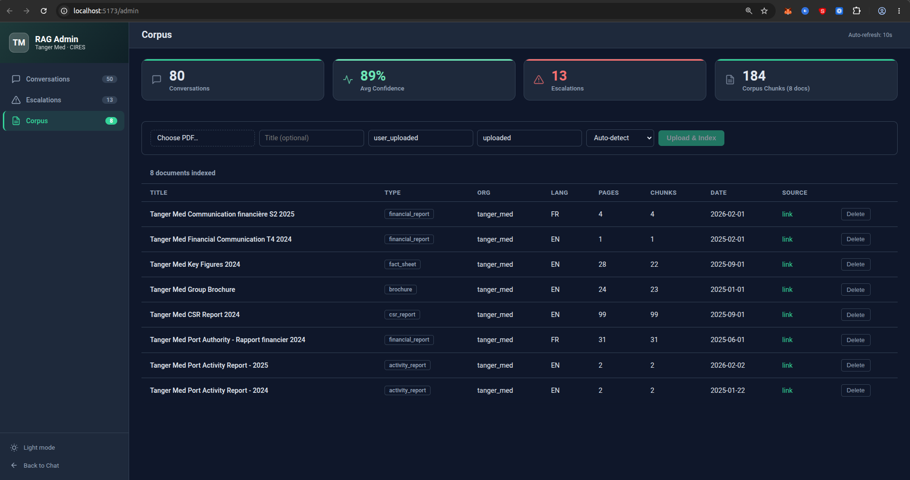
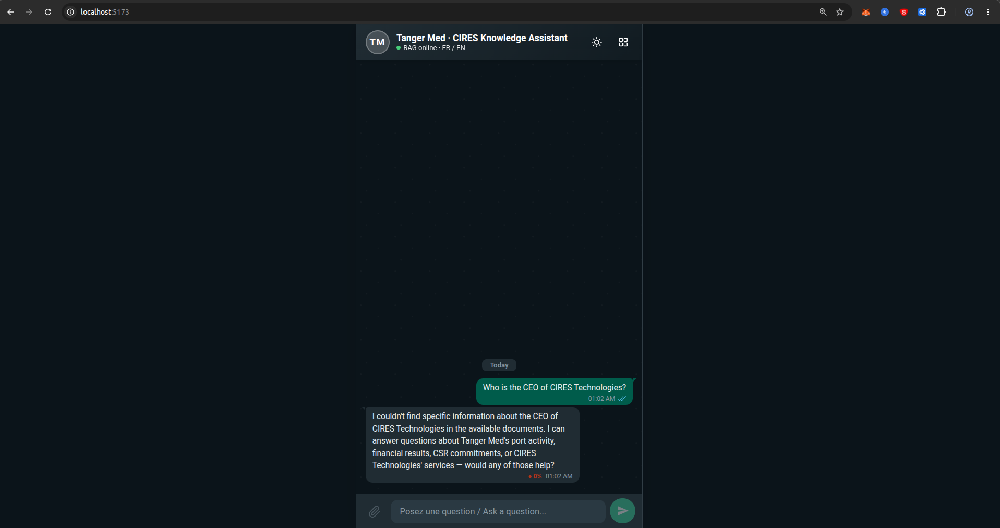
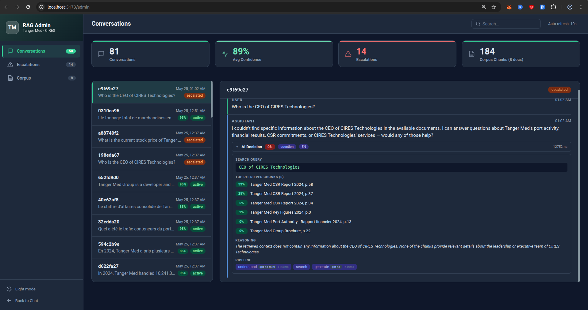
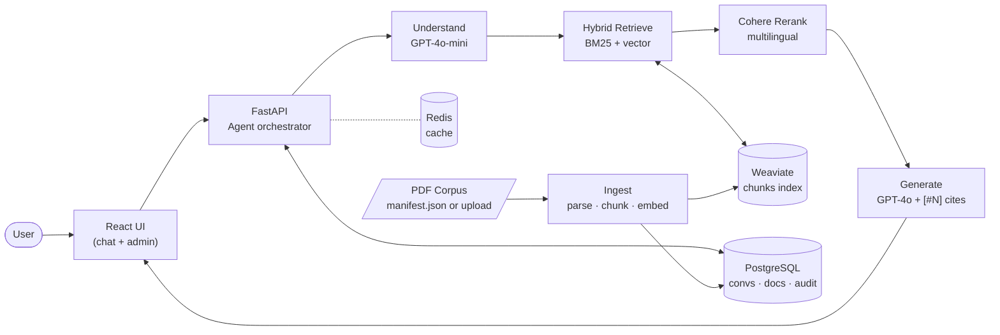

# Tanger Med · CIRES Technologies — RAG Knowledge Assistant

A bilingual (French / English) Retrieval-Augmented-Generation assistant that answers questions over a public corpus of **Tanger Med Group** and **CIRES Technologies** documents (annual reports, financials, CSR reports, brochures, press releases).

Built as a technical challenge for the **AI Engineer** position at CIRES Technologies (Tanger Med Group subsidiary).

> Companion docs in this repo: **[DESIGN.md](DESIGN.md)** (every meaningful decision + alternatives) and **[LIMITS.md](LIMITS.md)** (what's intentionally deferred and what we'd build next).

---

## TL;DR

Ask questions in French or English. The system:

1. **Understands** intent + language with GPT-4o-mini, rewriting follow-ups into standalone retrieval queries.
2. **Retrieves** the most relevant chunks from Weaviate using **hybrid search** (BM25 + dense vectors, OpenAI `text-embedding-3-small`, 1536-d).
3. **Reranks** the candidate chunks with Cohere `rerank-multilingual-v3.0` for sharper top-K precision.
4. **Generates** a grounded answer with GPT-4o, citing every fact back to the source PDF and page number — refusing honestly when the corpus can't support an answer.
5. **Audits** every step (intent, query rewrite, retrieval scores, generation) into PostgreSQL, surfaced in an admin dashboard with an escalation queue.

Example: *"Quel a été le trafic conteneurs de Tanger Med en 2024 ?"* → *"Tanger Med a traité 10 241 392 conteneurs en 2024, soit une hausse de 18,8 % par rapport à 2023 [#1]"* — with a clickable citation to the 2024 Port Activity Report, page 1.

---

## Evaluation

A 12-question golden set lives in [`eval/golden_questions.json`](eval/golden_questions.json) and the runner in [`eval/run_eval.py`](eval/run_eval.py). It covers FR + EN factual lookups, multi-source aggregation, and two *groundedness probes* (questions whose answers are NOT in the corpus — the system is expected to refuse honestly).

Run it:

```bash
python eval/run_eval.py
```

Latest run (`eval/results.json`) — **12 / 12 passed**:

| Metric | Value |
| --- | --- |
| Pass rate | **100% (12/12)** |
| Retrieval hit rate | 100% (correct doc cited) |
| Avg keyword recall | 100% (all expected facts surfaced) |
| Groundedness probes correct | 2 / 2 (no fabricated citations on out-of-corpus questions) |
| Avg confidence | 0.74 |
| Avg latency / turn | ~4.5 s end-to-end |

The eval scores four dimensions per question: did at least one **expected document** get cited, what fraction of **expected keywords** appear in the reply, did **confidence** land in the expected band, and (for groundedness probes) did the system **refuse** without inventing citations.

---

## Demo screenshots

### A real 5-turn conversation (context, citations, follow-up discipline)

| | |
| --- | --- |
|  |  |

The same conversation, scrolled. Five user turns: *"What is Tanger Med?"* → *"How many containers did they handle in 2024?"* → *"And how does that compare to 2023?"* → *"What about their revenue?"* → *"And what does their tech subsidiary CIRES do?"*

What this demonstrates:

- **Turn 1** (full intro): 99% confidence, 2 citations across the Group Brochure and Key Figures 2024.
- **Turn 2** ("they handle"): pronoun resolved silently. One-sentence answer with the exact figure (10,241,392 containers, +18.8%), cited to the Port Activity Report 2024 p.1. **No re-introduction** of the entity.
- **Turn 3** ("And how does that compare to 2023?"): retrieves 2023's 8.6M figure from a *different document* (Group Brochure p.6) and frames the comparison properly. 100% confidence.
- **Turn 4** ("What about their revenue?"): topic switch with pronoun. Direct revenue answer (1.135 billion USD) plus the related activity-zone business volume — both cited.
- **Turn 5** ("And what does their tech subsidiary CIRES do?"): lateral move to CIRES. The corpus contains no dedicated CIRES brochure, but the system surfaces CIRES's services + Digital Factory by retrieving passages from the parent group's CSR report.

This is the multi-turn discipline enforced by the system prompt and the runtime follow-up nudge in `agent.py`.

### Clickable citations open the source PDF directly



Citation chips are real `<a>` tags. The bottom of the screenshot shows the browser's URL preview on hover — `https://www.tangermed.ma/wp-content/uploads/2025/09/CSR-Report-2024.pdf`. A reviewer can click through to verify any cited fact against the original PDF page.

### Admin dashboard (audit trail + corpus stats)



Stats bar: 63 conversations, 88% average confidence, 10 escalations, 184 corpus chunks across 8 documents. Conversation list on the left with per-turn confidence and status badges (`active` / `escalated`). Right pane is a full conversation view with **per-turn audit chips** — intent classification (`question`, `follow_up`), detected language, and step latency (8358ms for the first turn's understand-step include + 3783ms for the follow-up). Each "▶ AI Decision" row expands to reveal the search query, retrieved chunks with relevance scores, and pipeline reasoning.

### The corpus is real, browsable, and accepts live uploads



The Corpus tab lists every ingested document with its type (`activity_report`, `financial_report`, `csr_report`, `brochure`, `fact_sheet`), language, page count, chunk count, publish date, and a `link` back to the source PDF. Each row has a Delete button that cleanly removes both the Postgres record and the corresponding Weaviate chunks.

The **Upload & Index** form at the top accepts any PDF (file picker, optional title, organization tag, document type, language override) and runs the same `parse → chunk → embed → index` pipeline inline within the request — typically ~5-30 seconds depending on the PDF. Useful when a reviewer hands you a fresh document mid-conversation.

### Honest refusal when the corpus can't answer



Question: *"Who is the CEO of CIRES Technologies?"* — a real factual question whose answer is **not** in any of the 8 ingested documents. The system replies with *"I couldn't find specific information about the CEO of CIRES Technologies in the available documents. I can answer questions about Tanger Med's port activity, financial results, CSR commitments, or CIRES Technologies' services — would any of those help?"*. Confidence is set to **0%** and the citation chip section is empty. No fabricated CEO name, no fabricated source.

### The audit trail proves the refusal was principled, not lazy



This is the *why* behind the previous screenshot. Expanding the "▼ AI Decision" panel on the same conversation reveals the full pipeline trace:

- **Intent** classified as `question`, **language** as `EN`, end-to-end latency `12752ms`.
- **Search query** rewrite landed on `CEO of CIRES Technologies` — exactly right.
- **Top retrieved chunks (6)** with their relevance scores: `33%, 25%, 5%, 2%, 0%, 0%`. The search ran, returned candidates, but **none were relevant enough** to answer the question.
- **Reasoning** captured by the generation step: *"The retrieved context does not contain any information about the CEO of CIRES Technologies. None of the chunks provide relevant details about the leadership or executive team..."*
- **Pipeline** chips on the bottom show the model cascade and timing — `understand` (gpt-4o-mini, 5148ms) → `search` → `generate` (gpt-4o, 1416ms).

This is the level of observability you'd want before deploying a RAG system in a regulated setting. Every refusal is auditable, every retrieval score is logged, every step's latency is traceable.

---

## Architecture



**Per-turn pipeline** (also visible per-message in the admin dashboard's audit panel):

```
user message
  ↓
[Understand] GPT-4o-mini : intent + language + stand-alone query rewrite (~300-800 ms)
  ↓
[Route] greeting/off_topic/human_request → skip retrieval; everything else → retrieve
  ↓
[Retrieve] Weaviate hybrid (BM25 + vector), 20 candidates (~150 ms)
  ↓
[Rerank] Cohere multilingual rerank → top-6 (~250 ms)
  ↓
[Generate] GPT-4o with retrieved chunks as context, [#N] citations enforced (~1-2 s)
  ↓
[Persist] message + citations + audit row in PostgreSQL
  ↓
answer with chips → user
```

---

## Tech stack

- **Backend** — FastAPI (async), SQLAlchemy 2.0, Pydantic 2
- **LLMs** — OpenAI GPT-4o (synthesis), GPT-4o-mini (understand)
- **Embeddings** — OpenAI `text-embedding-3-small` (1536-d, multilingual)
- **Vector DB** — Weaviate 1.28 (hybrid BM25 + cosine)
- **Reranker** — Cohere `rerank-multilingual-v3.0` (enabled by default)
- **Database** — PostgreSQL 16 (conversations, messages, documents, chunks, audit logs)
- **Cache** — Redis 7
- **Frontend** — React 18 + Vite, plain CSS
- **PDF parsing** — PyMuPDF (`fitz`)
- **Infra** — Docker Compose

## Project layout

```
backend/
├── ai/
│   ├── agent.py           # orchestrator: understand → retrieve → rerank → respond
│   ├── understand.py      # GPT-4o-mini step (intent + query rewrite)
│   ├── schemas.py         # Pydantic schemas (ConversationState, Citation, …)
│   └── prompts/
│       ├── system.txt     # grounded-answer prompt (FR/EN, [#N] citations)
│       └── understand.txt # intent / language / query-rewrite prompt
├── api/
│   ├── chat.py            # POST /api/chat
│   ├── admin.py           # /api/admin/* including live PDF upload
│   └── routes.py
├── search/
│   ├── weaviate_client.py # hybrid search over Chunks collection
│   └── rerank.py          # Cohere reranking
├── documents/
│   ├── parser.py          # PyMuPDF page-by-page extraction + FR/EN detection
│   ├── chunker.py         # page-aware chunking with overlap
│   └── ingest.py          # download → parse → chunk → embed → store
├── db/models.py           # Conversation, Message, Document, Chunk, AuditLog
├── core/config.py         # Pydantic Settings (env-driven)
└── main.py                # FastAPI app + lifespan + health
frontend/
├── src/pages/             # ChatPage (with suggested-query carousel), AdminPage
├── src/components/chat/   # bubbles with citation chips + confidence badge
└── src/components/admin/  # StatsBar, ConversationList, EscalationQueue, DocumentsList (with upload)
corpus/
├── manifest.json          # list of PDFs to ingest (URL + metadata)
└── pdfs/                  # downloaded PDFs (gitignored)
eval/
├── golden_questions.json  # 12-question test set (FR + EN + groundedness probes)
├── run_eval.py            # runs the set, scores retrieval/keywords/confidence
└── results.json           # latest run output
docker-compose.yml         # api, frontend, postgres, redis, weaviate, pgadmin, ingest
DESIGN.md                  # every meaningful decision + alternatives + tradeoffs
LIMITS.md                  # what's deferred and what we'd build next
```

---

## Quick start

### 1. Configure

```bash
cp .env.example .env
# Edit .env and set OPENAI_API_KEY=sk-...
# (Optional) set COHERE_API_KEY=... ; reranking is on by default
```

### 2. Boot the stack

```bash
docker compose up -d --build
```

| Service       | URL                          |
| ------------- | ---------------------------- |
| Chat UI       | http://localhost:5173        |
| Admin board   | http://localhost:5173/admin  |
| API + Swagger | http://localhost:8000/docs   |
| API health    | http://localhost:8000/health |
| pgAdmin       | http://localhost:5050        |
| Weaviate      | http://localhost:8080        |
| RedisInsight  | http://localhost:5540        |

### 3. Ingest the corpus

```bash
docker compose --profile cli run --rm ingest
```

This downloads every PDF in `corpus/manifest.json`, parses text page-by-page, chunks with overlap, embeds with OpenAI, and indexes the chunks in Weaviate (hybrid) and PostgreSQL.

### 4. (Optional) Live PDF upload during a demo

Open `/admin` → **Corpus** tab → pick a PDF, optionally fill title / type / language → **Upload & Index**. The file is parsed, chunked, embedded, and queryable within ~5-30 seconds depending on size. Useful in an interview when someone hands you a PDF.

Same flow from the CLI:

```bash
curl -F "file=@/path/to/your.pdf" \
     -F "title=Some Document" \
     -F "organization=tanger_med" \
     http://localhost:8000/api/admin/documents/upload
```

### 5. Run the eval

```bash
python eval/run_eval.py
# prints per-question scores and a summary; writes eval/results.json
```

---

## Example questions

**French**
- *Quel a été le chiffre d'affaires consolidé de Tanger Med en 2024 ?*
- *Quel a été le trafic conteneurs du port de Tanger Med en 2024 ?*
- *Quels engagements RSE Tanger Med a-t-il pris en 2024 ?*

**English**
- *What was Tanger Med's container throughput in 2024?*
- *How did 2024 compare to 2023 for container volume?*
- *What does CIRES Technologies offer?*
- *What were the GHG emissions of Tanger Med Port in 2024?*

**Groundedness probes (system should refuse honestly):**
- *Who is the CEO of CIRES Technologies?*
- *What is the current stock price of Tanger Med?*

---

## Corpus (current state)

Eight public Tanger Med Group documents (~180 chunks indexed):

| Document | Year | Lang | Source |
| --- | --- | --- | --- |
| Port Activity Report | 2024 | EN | [Tanger Med Port](https://www.tangermedport.com/wp-content/uploads/2025/01/CP-TMPA-PORT-ACTIVITY-REPORT-IN-2024.pdf) |
| Port Activity Report | 2025 | EN | [Tanger Med Press](https://www.tangermed.ma/wp-content/uploads/press-releases/2026/CP-TMPA-PORT-ACTIVITY-REPORT-IN-2025.pdf) |
| Rapport financier | 2024 | FR | [Tanger Med Docs](https://www.tangermed.ma/wp-content/uploads/documentations/2025/rapport-financier-2024-V-WEB.pdf) |
| CSR Report | 2024 | EN | [Tanger Med Docs](https://www.tangermed.ma/wp-content/uploads/2025/09/CSR-Report-2024.pdf) |
| Group Brochure | 2025 | EN | [Tanger Med Docs](https://www.tangermed.ma/wp-content/uploads/documentations/2025/Brochure-du-Groupe-TM-Veng.pdf) |
| Key Figures | 2024 | EN | [Tanger Med Docs](https://www.tangermed.ma/wp-content/uploads/2025/09/KF-VANG-USD.pdf) |
| Financial Comm T4 | 2024 | EN | [Tanger Med Docs](https://www.tangermed.ma/wp-content/uploads/documentations/2025/Finance-Com-T4-2024.pdf) |
| Communication financière S2 | 2025 | FR | [Tanger Med Docs](https://www.tangermed.ma/wp-content/uploads/documentations/2026/Communication-financiere-S2-2025.pdf) |

Adding a doc = appending an entry to `corpus/manifest.json` and re-running ingest (or using the live upload UI for one-off additions).

---

## What's deferred (see LIMITS.md for the full list)

- No authentication on the admin dashboard.
- No OCR for scanned PDFs (PyMuPDF only handles text-bearing PDFs).
- No streaming response (single-shot reply).
- No semantic chunking (current strategy is page-aware + fixed-size + overlap; works well for paragraph-rich PDFs).
- No structured table / figure extraction.
- No multi-modal queries (image questions).

Each of these has a "why-deferred" + "what we'd build next" entry in [LIMITS.md](LIMITS.md).

---

## Notes for the reviewer

This codebase was built from the architectural skeleton of a previous customer-service RAG project. The orchestration pattern (understand → route → retrieve → rerank → respond → audit) and the admin dashboard structure are reused; the corpus model, prompts, ingestion pipeline, eval harness, and frontend branding are all new for this challenge.

I chose **Option 2 — RAG** because it aligns directly with CIRES Technologies' core value proposition (knowledge work over complex, multilingual industrial documentation), and because pointing the demo at *your own* publicly available documents made for a more memorable proof point than another wikipedia toy.

The two companion docs — **[DESIGN.md](DESIGN.md)** and **[LIMITS.md](LIMITS.md)** — are written for a senior reviewer who wants to know not just what the system does but *why every choice was made* and *what would change at the next level of polish*.

Happy to walk through any of the design choices live. — Salma
